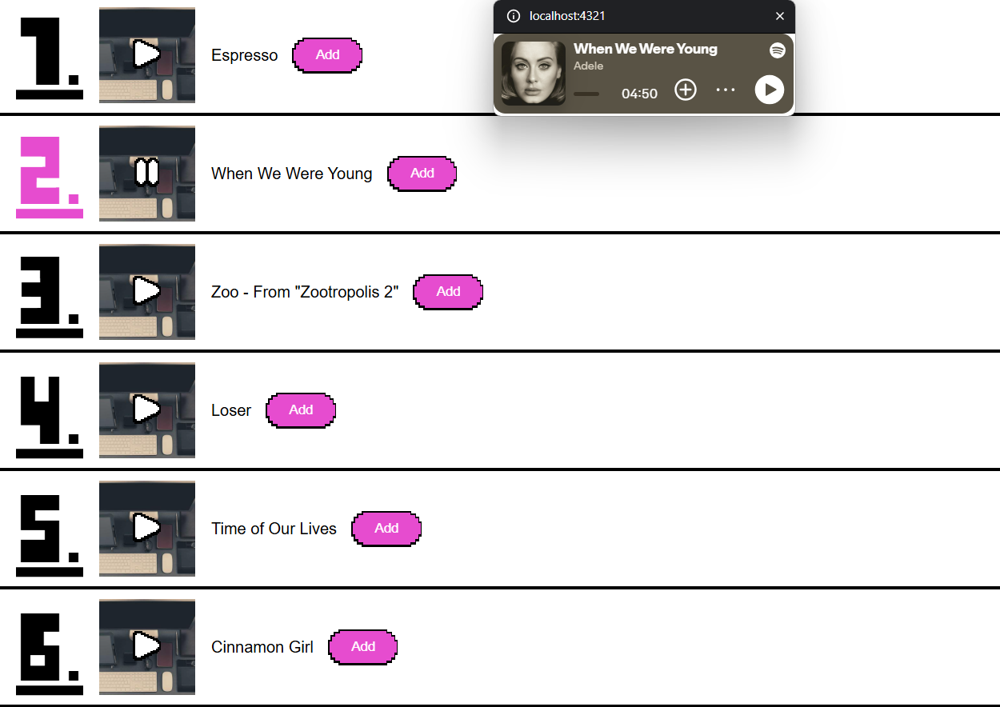

# API Project WDD

## Checkout 1-4-2026
Vandaag ben ik begonnen met het maken van een idee voor het project. 
Ik wil graag de spotify API combineren met een videogame API waarbij ik op basis van een game genre aan de hand van web AI
een aantal nummer suggesteer, waarmee de gebruiker kan zeggen of hij/zij deze in de playlist wil.

## Weekly Checkout 2-4-2026
Na het gesprek met mijn clubje en Cyd ben ik tot de conclusie gekomen dat de beste eerstvolgende stap is:
Het toevoegen van de Spotify/playlist functionaliteit zonder dat dit gekoppeld is aan de web AI of videogame API

## Checkout 8-4-2026 
Vandaag heb ik button components gemaakt voor mijn website en Icon components, hier ben ik zo'n 3.5 uur mee bezig geweest.
Ook heb ik dummy songs toegevoegd voor tijdens het developen, omdat ik er tegenaanliep dat ik een timeout kreeg van de spotify api :(
Morgen wil ik verder gaan met het maken van het song component en het playlist component.

## Checkout 9-4-2026
Vandaag heb ik de Document Picture in Picture web api gebruikt om een iframe in te laden wanneer een liedje wordt afgespeeld.
Om het geselecteerde nummer duidelijker te maken heb ik een animatie toegevoegd met een variabel font en en kleur gegeven aan het nummer.
Omdat ik er gister tegenaanliep dat ik een timeout kreeg heb ik voor de zekerheid een lijst met dummy liedjes toegevoegd voor tijdens het ontwikkelen.

## Weekly checkout 10-4-2026
Vandaag heb ik feedback ontvangen op mijn werk wat ik tot nu toe heb.

Volgende week wil ik gaan kijken naar: 
- Het implementeren van een spotify player die de liedjes automatisch afspeelt en deze in de PiP zetten.
- OF een playlist in de PiP zetten.
- OF een playlist ergens anders op de pagina zetten die in realtime update als je iets toevoegt.
- Een 'add playlist to spotify button' toevoegen zodat ik niet meerdere calls iedere keer naar de spotify api doe, maar 1 call doe.
- Inspiratie opzoeken en kijken naar andere web players.

## Checkout 22-4-2026
Vandaag heb ik 

# Stijl inspiratie
View transitions als nummer naar playlist gaat,
Document pip voor playlist weergave

Na het maken van de projecten voor CSS en BT, ben ik er achter gekomen dat het handig is om eerst een moodboard te maken.
Hierdoor denk ik bewuster na over wat ik ga maken en of het bij de stijl past. Hier vind je mijn inspiratiebronnen voor dit project.

https://www.sensorvariablefont.com/variable-font-reacts-to-music/
https://vimeo.com/809461900?fl=pl&fe=sh

## fun fonts: 
https://fontesk.com/furnitur-font/  
https://fontesk.com/kikuta-font/  
https://fontesk.com/bitcount-typeface/  
https://fontesk.com/that-then-this-font/
https://fontesk.com/mini-mochi-font/   
https://fontesk.com/ojuju-font/

# Commands

* `npm install` → installs dependencies
* `npm run dev` → starts development server
* `npm run build` → builds the app for production
* `npm run preview` → previews the production build locally
* `npm run start` → starts the app on the correct port (for deployment)
